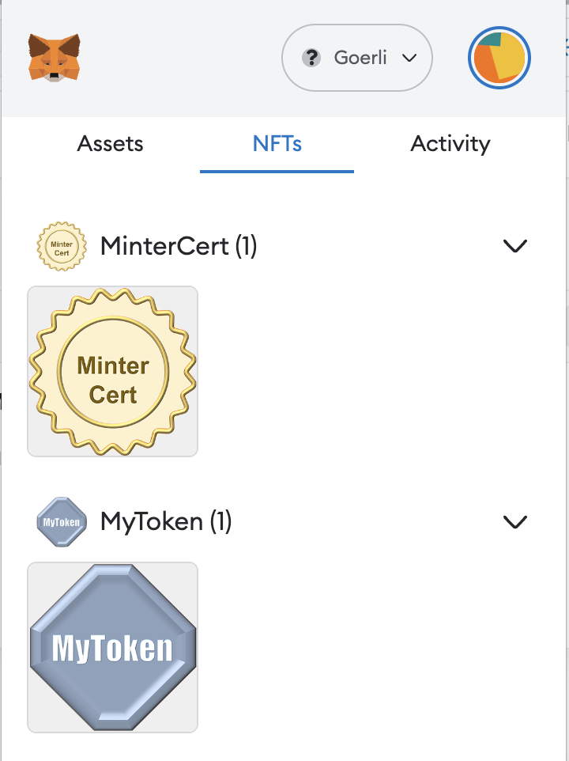

[[token-controlled-token-circulation]]
== Token-Controlled Token Circulation (TCTC)

The circulation of tokens comprises three types of principal transactions: mint, transfer, and burn. Depending on the application, various conditions must be satisfied to execute these transactions, e.g., only qualified shops can mint the tokens and only a certain agent can transfer the tokens. We propose to use the tokens themselves to control these permissions. The system mints, transfers, or burns a token only if the control tokens are owned by the participants of the transaction. The circulation control tokens themselves can be any type of token, e.g., a driver's license or a membership certificate of a certain group, and recursively circulated in the token circulating system. This scheme eliminates the need to write complex circulation control in smart contracts for each application, improving the security of the system and reducing development costs.

[[using-token-controller]]
=== Using `TokenController`

TokenController is another contract that provides xref:api:access.adoc#Roles[`Roles`] for implementing role-based access control. 

Its usage is straightforward: for each role that you want to define, you will create a new _role identifier_ that is used to grant, revoke, and check if an account has that role. For each role, tokenController has the mapping of contract IDs, which will hold the list of contracts of the token the participant must own with that role. When _grantRoleByToken() is called multiple times, it requires to have a token of at least one of the contract IDs specified by the interface. 

Here's a simple example of using `TokenController` in an xref:tokens.adoc#ERC721[`ERC721` token] to define a 'minter' and 'burner' role, which allows accounts that have it create new tokens and destroy existing tokens by specifying the controll token:

[source,solidity]
----
// contracts/MyToken.sol
// SPDX-License-Identifier: MIT

pragma solidity ^0.8.9;

import "@openzeppelin/contracts/token/ERC721/ERC721.sol";
import "@openzeppelin/contracts/token/ERC721/extensions/ERC721URIStorage.sol";
import "./TokenController.sol";

contract MyToken is ERC721, TokenController {
    bytes32 public constant MINTER_ROLE = keccak256("MINTER_ROLE");
    bytes32 public constant BURNER_ROLE = keccak256("HOLDER_ROLE");

    constructor() ERC721("MyToken", "MTK") {
        // Specifies the deployed contract ID of the control token.
        // This sample contract is deployed on Goerli.
        _grantRoleByToken(MINTER_ROLE, 0xF1e33c646a12F68bC8015b4AED29BB316fA2D593);
        _grantRoleByToken(BURNER_ROLE, 0xcDc6fD5F29E2641f25c90235eDA984f99aA3a1DD);
    }

    function safeMint(address to, uint256 tokenId)
        public onlyHasToken(MINTER_ROLE, msg.sender)
    {
        _safeMint(to, tokenId);
    }

    function burn(uint256 tokenId) 
        public onlyHasToken(BURNER_ROLE, msg.sender) 
    {
        _burn(tokenId);
    }
}
----

[[granting-and-revoking]]
=== Granting and Revoking Roles

This example above uses `_grantRoleByToken`, an `internal` function that is useful when programmatically assigning roles (such as during construction). However, granting the 'minter' or 'burner' role to the actual user account is independent of this contract generation. For example, for a user to obtain minter role, they must obtain the required control token from the specified control token issuer. The following is the case where minter role is assigned to the issuer of MyToken as a token called Minter Cert. Similarly, a minter role can be revoked by burning the Minter Cert by the issuer.

For more information on this scheme, please refer to the https://ssrn.com/abstract=4297719[white paper].

== Reference Implementation on "plain" OpenZeppelin.

=== Code on Goerli testnet.
https://goerli.etherscan.io/address/0xd44ea7db0a1690d8784bb9cdab7d420b94a29c21#code

=== Source Code on Remix
https://remix.ethereum.org/address/0xd44Ea7Db0a1690D8784BB9CDaB7d420b94A29C21

== Reference Implementation on ERC5679

=== Code on Goerli testnet.
https://goerli.etherscan.io/address/0x647a3b5b039c9fe13df5d81e8b65063572ac655c#code

=== Source Code on Remix
https://remix.ethereum.org/address/0x647A3b5B039C9Fe13df5d81E8b65063572Ac655c

== White Paper
https://ssrn.com/abstract=4297719
