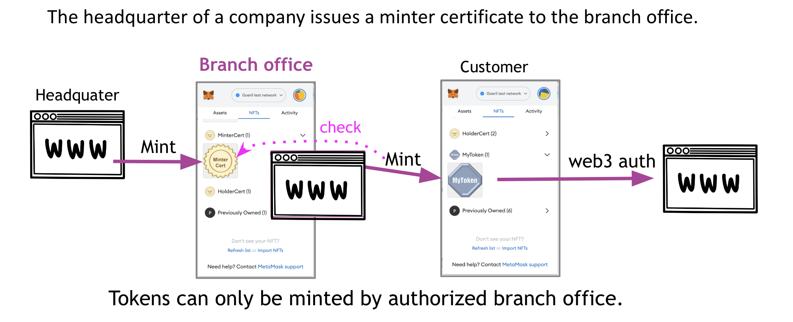
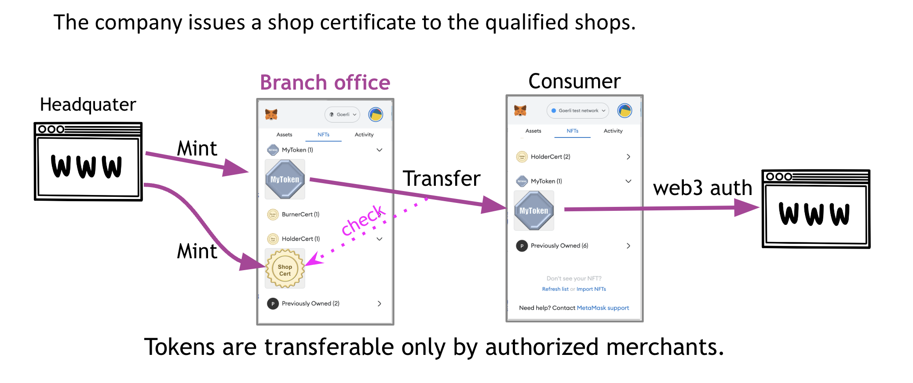
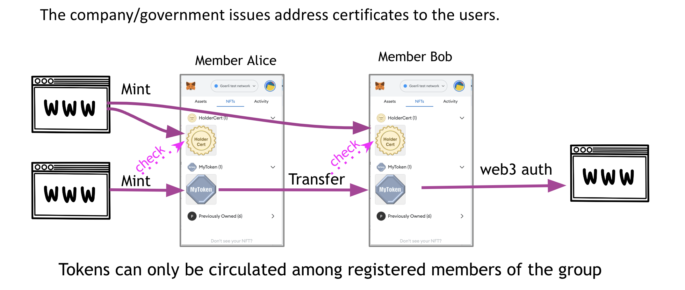

[[token-controlled-token-circulation]]
== Token-Controlled Token Circulation (TCTC)

*Note: The specification of TCTC is published as ERC-7303(https://eips.ethereum.org/EIPS/eip-7303). This is additional documentation of TCTC.*

The circulation of tokens involves three main types of transactions: minting, transferring, and burning. Various conditions must be met to execute these transactions depending on the application; for instance, only certified stores can mint tokens, and only specific agents can transfer them. We suggest using the tokens themselves to regulate these permissions. The system will mint, transfer, or burn a token only if the controlling tokens are owned by the transaction participants. These circulation control tokens could be any type of token, such as a driver's license or a group membership certificate, and can be circulated recursively within the token circulation system.

In a traditional system, achieving such access control requires an off-chain management tool to grant or revoke necessary roles through the interface specified in the ERC-5982 role-based access control. However, representing such a role as a token eliminates the need for developing off-chain tools, potentially enhancing system security and reducing development costs.

[[use-cases]]
== Use cases

Access control, which determines who can execute specific functions, is very important in the context of smart contracts. Therefore, the use cases for TCTC are broad and not limited to the following, but we show some typical examples.

=== Case1: Mint Permission
This is the simplest case. Let's consider a situation where a company wants to distribute MyToken to their customers. MyToken can be any token, but we assume that this is the ticket to watch some content at some content delivery server. If the company has several branch offices, the headquarters may want to grant minting privileges to these branches. This can be achieved by issuing a minter certificate, in the form of a control token, to each branch office. The branch office then mints tokens, in this case, MyToken, and distributes them to their customers via their own website. 

=== Case2: Transfer Permission
Next, we have an example of using transfer permission. Let's consider a similar situation where a company wants to distribute MyToken to their customers, as in the previous use case. However, in this scenario, the number of tokens minted must be controlled by the headquarters. The headquarters may not want to grant minting privileges to the branches. Instead, transfer privileges are granted to these branches. 

Depending on the business model, we can thus flexibly control the circulation of tokens. By the way, if no one is granted transfer permission, this token becomes a non-transferable token. 

=== Case3: Address Verificaiton
Many applications require address verification to prevent errors in the recipient's address when minting or transferring target tokens. An address certificate or holder certificate is useful in such situations. It is issued as proof of address verification to users before conducting transactions for target tokens. Typically, this certificate may be issued by a government agency or specific company after an identity verification process.

This address certificate is then required by the recipient when a minting or transfer transaction is executed, thereby preventing misdeliveries.

[[using-token-controller]]
=== Using `ERC-7303`

link:contracts/ERC7303.sol[ERC7303.sol] is the contract that provides the functions for implementing TCTC.

Its usage is straightforward: for each role that you want to define, you will create a new _role identifier_ that is used to grant, revoke, and check if an account has that role. For each role, ERC-7303 has the mapping of contract IDs, which will hold the list of contracts of the token the participant must own with that role. When _grantRoleByERCXXX() is called multiple times, it requires to have a token of at least one of the contract IDs specified by the interface. 

Here's a simple example of using `ERC-7303` in an xref:tokens.adoc#ERC721[`ERC-721`] token or xref:tokens.adoc#ERC1155[`ERC-1155`] token to define a 'minter' and 'burner' role, which allows accounts that have it create new tokens and destroy existing tokens by specifying the controll token:

[source,solidity]
----
// SPDX-License-Identifier: Apache-2.0

pragma solidity ^0.8.20;

import "@openzeppelin/contracts/token/ERC721/ERC721.sol";
import "@openzeppelin/contracts/token/ERC721/extensions/ERC721URIStorage.sol";
import "./ERC7303.sol";

contract MyToken is ERC721, ERC7303 {
    bytes32 public constant MINTER_ROLE = keccak256("MINTER_ROLE");
    bytes32 public constant BURNER_ROLE = keccak256("BURNER_ROLE");

    constructor() ERC721("MyToken", "MTK") {
        // Specifies the deployed contractId of ERC721 control token.
        _grantRoleByERC721(MINTER_ROLE, 0x...);
        _grantRoleByERC721(BURNER_ROLE, 0x...);

        // Specifies the deployed contractId and typeId of ERC1155 control token.
        _grantRoleByERC1155(MINTER_ROLE, 0x..., ...);
        _grantRoleByERC1155(BURNER_ROLE, 0x..., ...);
    }

    function safeMint(address to, uint256 tokenId)
        public onlyHasToken(MINTER_ROLE, msg.sender)
    {
        _safeMint(to, tokenId);
    }

    function burn(uint256 tokenId) 
        public onlyHasToken(BURNER_ROLE, msg.sender) 
    {
        _burn(tokenId);
    }
}
----

[[granting-and-revoking]]
=== Granting and Revoking Roles

This example above uses `_grantRoleByERCXXX`, an `internal` function that is useful when programmatically assigning roles (such as during construction). However, granting the 'minter' or 'burner' role to the actual user account is independent of this contract generation. For example, for a user to obtain minter role, they must obtain the required control token from the specified control token issuer. In the use case above, minter role is assigned to the issuer of MyToken as a token called Minter Cert. Similarly, a minter role can be revoked by burning the Minter Cert by the issuer.

== Reference Implementation on "plain" OpenZeppelin.

=== Code on Sepolia (New version)

Example of specifying MinterCert/BurnerCert
https://sepolia.etherscan.io/address/0xfacee0d2f7e4ebe9620747434ee22095449252ea#code

Example of specifying complex conditions:
https://sepolia.etherscan.io/address/0x0b57d5752f35071ad47c4448a2e106757a111835#code

=== Code on Polygon zkEVM
https://zkevm.polygonscan.com/address/0x63e0845cF578993d7946E759B71BC3e91Db43790#code

== Reference Implementation on ERC5679

=== Code on Goerli testnet.
<< to be updated for updated version of ERC-7303 >>
https://goerli.etherscan.io/address/0x647a3b5b039c9fe13df5d81e8b65063572ac655c#code

== References
White Paper: https://ssrn.com/abstract=4297719

Original concept source (1999): http://www.usenix.org/events/sec99/full_papers/fujimura/fujimura.pdf
