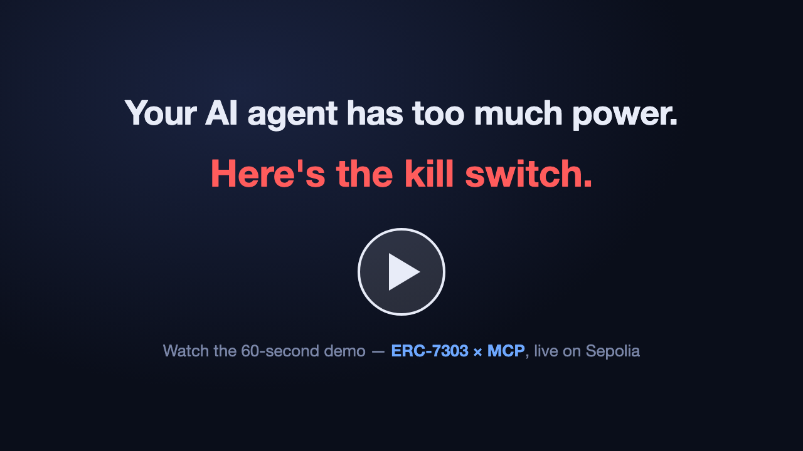
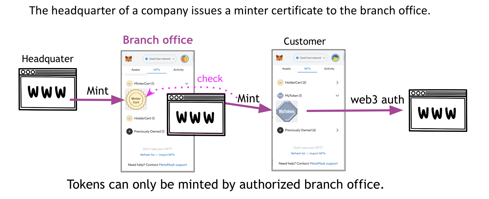
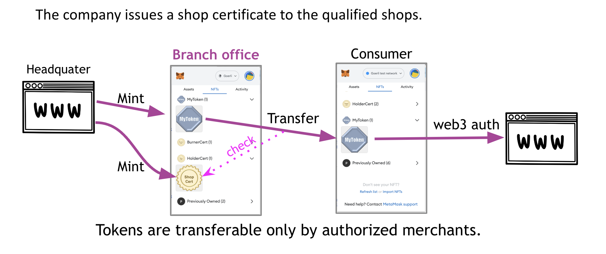
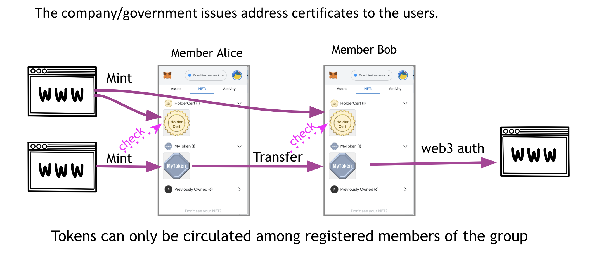

[[token-controlled-token-circulation]]
== Token-Controlled Token Circulation (TCTC)

*Note: The specification of TCTC is published as ERC-7303(https://eips.ethereum.org/EIPS/eip-7303). This is additional documentation of TCTC.*

The circulation of tokens involves three main types of transactions: minting, transferring, and burning. Various conditions must be met to execute these transactions depending on the application; for instance, only certified stores can mint tokens, and only specific agents can transfer them. We suggest using the tokens themselves to regulate these permissions. The system will mint, transfer, or burn a token only if the controlling tokens are owned by the transaction participants. These circulation control tokens could be any type of token, such as a driver's license or a group membership certificate, and can be circulated recursively within the token circulation system.

In a traditional system, achieving such access control requires an off-chain management tool to grant or revoke necessary roles through the interface specified in the ERC-5982 role-based access control. However, representing such a role as a token eliminates the need for developing off-chain tools, potentially enhancing system security and reducing development costs.

[[tctc-for-ai-agents]]
== TCTC for AI Agents: Permission Control Without a Permission Server

We are entering a world where AI agents do real work on our behalf — they operate services, manage assets, and execute transactions. Delegating work to an agent means delegating *authority*, and that raises three questions every agent deployment must answer:

* How do you grant an agent exactly the capability it needs — and no more?
* How can anyone verify what an agent is currently allowed to do?
* When an agent misbehaves or its key leaks, how do you revoke its authority *instantly*?

The traditional answer is a permission server: centralized infrastructure that issues credentials, checks scopes, and must itself be operated, secured, and trusted. TCTC removes that infrastructure entirely, because the chain itself becomes the policy decision point:

* *A role is a token.* An agent holds a role if and only if it owns the control token (typically a soulbound ERC-721/ERC-1155).
* *Grant = mint.* The human principal mints a role token to the agent's account.
* *Revoke = burn.* Burning the token is the kill switch: at the agent's very next transaction, the on-chain check fails and the contract reverts with `ERC7303: not has a required token`. No server restart, no API-key rotation.
* *Verification is public.* Any third party can read an agent's authority on-chain via `balanceOf`.
* *Enforcement is on-chain.* The `onlyHasToken` modifier is the enforcement point. Even a malicious agent that skips every off-chain check gains nothing — its transaction reverts.

Identity standards such as ERC-8004 (Trustless Agents) answer _who_ an agent is and whether it is reputable; TCTC / ERC-7303 answers _what it is allowed to do_. The two compose cleanly, for example by binding control tokens to the ERC-6551 token-bound account of the agent's identity NFT, so permissions survive agent wallet rotation.

[[tctc-mcp]]
=== MCP Server: tctc-mcp

_60-second demo: a human grants an AI agent a minting permission, the agent verifies it on-chain and mints; the human burns the role token, and the agent instantly loses the capability._

https://github.com/kofujimura/tctc-mcp[*tctc-mcp*] connects TCTC to AI agents through the Model Context Protocol (MCP), so any MCP-compatible agent (Claude Code, Claude Desktop, and others) can use it out of the box:

* *Agent side (read-only mode):* the agent checks its own on-chain permissions before acting, using the `list_roles`, `check_role`, and `check_all_roles` tools. State-changing tools are not even registered in this mode.
* *Principal side (admin mode):* the human grants and revokes roles in natural language — "Revoke the agent's MINTER_ROLE" becomes a `burn` transaction on the control token.
* *ERC-8004 / ERC-6551 bridge:* an `agentId` can be resolved to its token-bound account, the recommended target for granting control tokens.

The full cycle — mint a role token to an agent, the agent verifies its role and acts, the human burns the token, and the agent instantly loses the capability — has been verified end-to-end on Sepolia. The repository includes a demo configuration pointing at live, Etherscan-verified contracts.

[[use-cases]]
== Use cases

Access control, which determines who can execute specific functions, is very important in the context of smart contracts. Therefore, the use cases for TCTC are broad and not limited to the following, but we show some typical examples.

=== Case1: Mint Permission
This is the simplest case. Let's consider a situation where a company wants to distribute MyToken to their customers. MyToken can be any token, but we assume that this is the ticket to watch some content at some content delivery server. If the company has several branch offices, the headquarters may want to grant minting privileges to these branches. This can be achieved by issuing a minter certificate, in the form of a control token, to each branch office. The branch office then mints tokens, in this case, MyToken, and distributes them to their customers via their own website. 

=== Case2: Transfer Permission
Next, we have an example of using transfer permission. Let's consider a similar situation where a company wants to distribute MyToken to their customers, as in the previous use case. However, in this scenario, the number of tokens minted must be controlled by the headquarters. The headquarters may not want to grant minting privileges to the branches. Instead, transfer privileges are granted to these branches. 

Depending on the business model, we can thus flexibly control the circulation of tokens. By the way, if no one is granted transfer permission, this token becomes a non-transferable token. 

=== Case3: Address Verificaiton
Many applications require address verification to prevent errors in the recipient's address when minting or transferring target tokens. An address certificate or holder certificate is useful in such situations. It is issued as proof of address verification to users before conducting transactions for target tokens. Typically, this certificate may be issued by a government agency or specific company after an identity verification process.

This address certificate is then required by the recipient when a minting or transfer transaction is executed, thereby preventing misdeliveries.

[[using-token-controller]]
=== Using `ERC-7303`

link:contracts/ERC7303.sol[ERC7303.sol] is the contract that provides the functions for implementing TCTC. It implements the link:contracts/IERC7303.sol[IERC7303] introspection interface, so that a contract's role structure can be discovered on-chain (see <<introspection>> below).

Its usage is straightforward: for each role that you want to define, you will create a new _role identifier_ that is used to grant, revoke, and check if an account has that role. For each role, ERC-7303 has the mapping of contract IDs, which will hold the list of contracts of the token the participant must own with that role. When _grantRoleByERCXXX() is called multiple times, it requires to have a token of at least one of the contract IDs specified by the interface. 

Here's a simple example of using `ERC-7303` in an xref:tokens.adoc#ERC721[`ERC-721`] token or xref:tokens.adoc#ERC1155[`ERC-1155`] token to define a 'minter' and 'burner' role, which allows accounts that have it create new tokens and destroy existing tokens by specifying the controll token:

[source,solidity]
----
// SPDX-License-Identifier: Apache-2.0

pragma solidity ^0.8.20;

import "@openzeppelin/contracts/token/ERC721/ERC721.sol";
import "@openzeppelin/contracts/token/ERC721/extensions/ERC721URIStorage.sol";
import "./ERC7303.sol";

contract MyToken is ERC721, ERC7303 {
    bytes32 public constant MINTER_ROLE = keccak256("MINTER_ROLE");
    bytes32 public constant BURNER_ROLE = keccak256("BURNER_ROLE");

    constructor() ERC721("MyToken", "MTK") {
        // Specifies the deployed contractId of ERC721 control token.
        _grantRoleByERC721(MINTER_ROLE, 0x...);
        _grantRoleByERC721(BURNER_ROLE, 0x...);

        // Specifies the deployed contractId and typeId of ERC1155 control token.
        _grantRoleByERC1155(MINTER_ROLE, 0x..., ...);
        _grantRoleByERC1155(BURNER_ROLE, 0x..., ...);
    }

    function safeMint(address to, uint256 tokenId)
        public onlyHasToken(MINTER_ROLE, msg.sender)
    {
        _safeMint(to, tokenId);
    }

    function burn(uint256 tokenId)
        public onlyHasToken(BURNER_ROLE, msg.sender)
    {
        _burn(tokenId);
    }

    // Expose IERC7303 via ERC-165 (required by the updated ERC-7303 spec).
    function supportsInterface(bytes4 interfaceId)
        public view override returns (bool)
    {
        return interfaceId == type(IERC7303).interfaceId || super.supportsInterface(interfaceId);
    }
}
----

[[granting-and-revoking]]
=== Granting and Revoking Roles

This example above uses `_grantRoleByERCXXX`, an `internal` function that is useful when programmatically assigning roles (such as during construction). However, granting the 'minter' or 'burner' role to the actual user account is independent of this contract generation. For example, for a user to obtain minter role, they must obtain the required control token from the specified control token issuer. In the use case above, minter role is assigned to the issuer of MyToken as a token called Minter Cert. Similarly, a minter role can be revoked by burning the Minter Cert by the issuer.

[[introspection]]
=== Introspection (IERC7303)

The updated ERC-7303 specification (https://github.com/ethereum/ERCs/pull/1872[ethereum/ERCs#1872], merged 2026-07-11) requires compliant contracts to expose their role structure on-chain through the `IERC7303` interface:

* `hasRole(bytes32 role, address account)` — does the account currently hold the role?
* `getERC721ControlTokens(bytes32 role)` / `getERC1155ControlTokens(bytes32 role)` — which control tokens gate the role
* `ERC721ControlTokenAdded` / `ERC1155ControlTokenAdded` events on configuration
* ERC-165 detection with interfaceId `0x4ee69337`

Originally, ERC-7303 defined no interface: the party that configured a contract's roles was assumed to know its role structure, having designed it. Autonomous agents break this assumption — an agent exercising delegated authority is not the designer of the permission structure it operates under — so the contract itself must describe its role structure machine-readably. Tools such as https://github.com/kofujimura/tctc-mcp[tctc-mcp] (v0.2+) use this interface to discover role bindings automatically, with no configuration.

== Reference Implementation on "plain" OpenZeppelin

All contracts below are deployed on Sepolia, Etherscan-verified, and implement the `IERC7303` introspection interface (ERC-165 interfaceId `0x4ee69337`).

=== Target token examples

* link:contracts/MyToken.sol[MyToken.sol] — simple case: minting/burning gated by MinterCert/BurnerCert: +
https://sepolia.etherscan.io/address/0x4682f98e7595D4478b398cC29d116b54a8FBA484#code
* link:contracts/MyComplexToken.sol[MyComplexToken.sol] — complex conditions: `MINTER_ROLE` is an OR over two certificate types, and minting additionally requires `MEMBER_ROLE` (AND across roles): +
https://sepolia.etherscan.io/address/0x873f0bf314A1e0B566015CEf9dA37783A729Fd02#code

=== Control tokens

* `AgentControlTokens` — soulbound, *issuer-burnable* ERC-1155 (typeId 1 = MinterCert, 2 = BurnerCert, 3 = PartnerMinterCert): +
https://sepolia.etherscan.io/address/0x12342A7F0190B3AF3F4b47546D34006EDA54eE0B#code
* `TCTC Membership` — soulbound ERC-721, the `MEMBER_ROLE` control token: +
https://sepolia.etherscan.io/address/0x4223260CEf7cbA173C227b1B11E8a6a8Ce2E388a#code

Because the certificates are burnable by the issuer, revocation does not depend on the holder's cooperation: burning the certificate is the kill switch, as required for autonomous-agent deployments by the Security Considerations of ERC-7303.

== References
White Paper: https://ssrn.com/abstract=4297719

Original concept source (1999): http://www.usenix.org/events/sec99/full_papers/fujimura/fujimura.pdf
